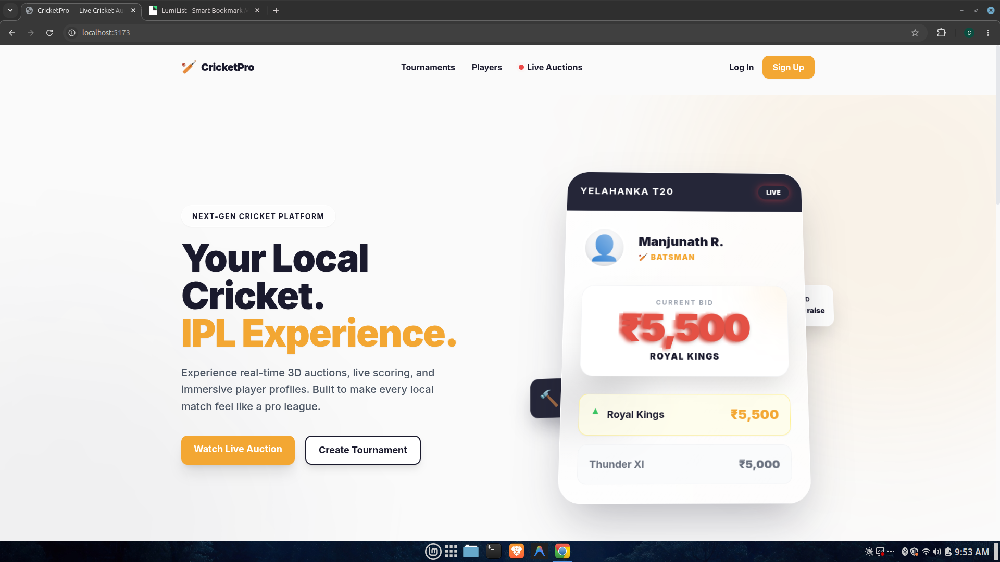
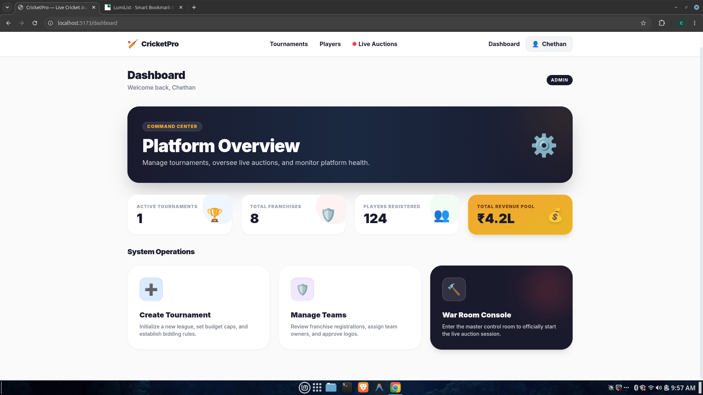
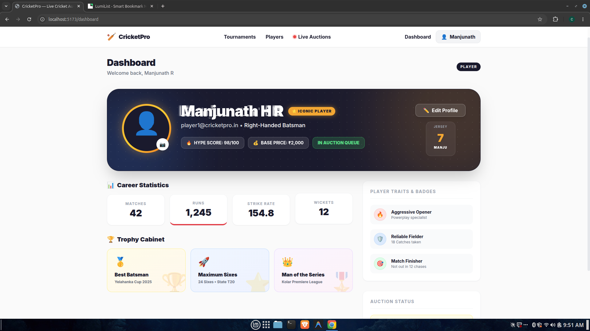

<!-- PROJECT LOGO & HERO -->
<br />
<div align="center">

  <h1 align="center">🏏 CRICKETPRO</h1>

  <p align="center">
    <strong>The Ultimate IPL-Style Real-Time Live Auction Platform</strong>
    <br />
    <br />
    <a href="https://github.com/chethanhrx/CricketPro/issues">Report Bug</a>
    ·
    <a href="https://github.com/chethanhrx/CricketPro/issues">Request Feature</a>
  </p>

  <!-- SHIELD BADGES -->
  <p align="center">
    
    
    
  </p>
</div>

---

<!-- ABOUT THE PROJECT -->
## 🌟 About The Project

> **CricketPro** is a hyper-premium, full-stack web application designed to simulate the exhilarating experience of a franchise cricket auction. Built with real-time WebSockets, robust Spring Boot micro-services, and an ultra-modern React glassmorphism interface, it transforms any room into a high-stakes auction war room.

<br/>

### 📸 Platform Showcase

<div align="center">
  <table>
    <tr>
      <td align="center" width="50%">
        <b>🏠 Welcome to CricketPro</b><br/><br/>
        
      </td>
      <td align="center" width="50%">
        <b>👑 Franchise Owner Dashboard</b><br/><br/>
        
      </td>
    </tr>
    <tr>
      <td align="center" colspan="2" width="100%">
        <b>⭐ Iconic Player Profile Showcase</b><br/><br/>
        
      </td>
    </tr>
  </table>
</div>

<br/>

---

## 🔥 Deep-Dive Features

### ⚔️ The Live Bidding War Room
* **Real-Time WebSockets**: Bids, timer updates, and player states synchronize instantly across hundreds of connected clients with zero latency.
* **Smart Bidding Engine**: Automated highest-bidder tracking, instant purse deduction validation, and clash-resolution logic.
* **Dynamic Timer**: Server-authoritative countdown clock that resets based on live bid interactions.

### 🎭 Role-Based Command Centers
<details>
<summary><b>🛡️ Franchise Team Owner</b></summary>
<br/>

* **Live Strategy Room**: Enter the private bidding portal to submit live bids.
* **Dynamic Purse Management**: Real-time budget progress bars and spending velocity tracking.
* **Squad Analytics**: View acquired players, icon player counts, and overall team balance metrics.
</details>

<details>
<summary><b>⚙️ Admin & Tournament Organizer</b></summary>
<br/>

* **Platform Control Panel**: Massive command center to monitor live revenue pools, total franchises, and platform health.
* **Auction Session Control**: Manually dictate the flow of the auction, select the next player, and officially declare "SOLD!".
* **Tournament Setup**: Configure league rules, initialize massive player pools, and manage team registrations.
</details>

<details>
<summary><b>🏏 The Players</b></summary>
<br/>

* **Glassmorphism Profile**: A breathtaking profile dashboard highlighting the player's custom jersey name and number.
* **Trophy Cabinet**: Glowing 3D achievement cards for titles like "Best Batsman" or "Tournament MVP".
* **Live Status**: Real-time "Hype Score" metrics, base price tags, and live tracking of their queue position.
</details>

---

## 🛠️ Technology Stack

<div align="center">
  <table>
    <tr>
      <td align="center" width="33%">
        <br/>
        <b>React 18</b><br/><i>Frontend Core</i>
      </td>
      <td align="center" width="33%">
        <br/>
        <b>Tailwind CSS</b><br/><i>Glassmorphism Styling</i>
      </td>
      <td align="center" width="33%">
        <br/>
        <b>Spring Boot 3</b><br/><i>Backend Services</i>
      </td>
    </tr>
    <tr>
      <td align="center" width="33%">
        <br/>
        <b>PostgreSQL</b><br/><i>Database & Persistence</i>
      </td>
      <td align="center" width="33%">
        <br/>
        <b>WebSockets (STOMP)</b><br/><i>Real-Time Sync</i>
      </td>
      <td align="center" width="33%">
        <br/>
        <b>Java 21</b><br/><i>Core Language</i>
      </td>
    </tr>
  </table>
</div>

---

## 🚀 Getting Started

Follow these steps to get your local development environment up and running instantly. 

### 🐧 Option A: Linux & macOS (Automated)

We've bundled a powerful shell script that compiles the backend, installs frontend dependencies, and boots both servers simultaneously.

1. **Clone the repository**
   ```bash
   git clone https://github.com/chethanhrx/CricketPro.git
   cd CricketPro
   ```

2. **Run the master boot script**
   ```bash
   chmod +x start.sh
   ./start.sh
   ```

3. **Open the App**  
   Navigate to <kbd>http://localhost:5173</kbd> in your browser.

> **Note**: To stop the servers gracefully, press <kbd>Ctrl</kbd> + <kbd>C</kbd>. If the database file remains locked upon restart, run `pkill -f java && rm -rf backend/data/*`.

<br/>

### 🪟 Option B: Windows (Manual Dual-Boot)

1. **Start the Backend (Terminal 1)**
   ```cmd
   cd CricketPro\backend
   .\mvnw.cmd spring-boot:run
   ```
   *Wait until you see `CricketProApplication started`...*

2. **Start the Frontend (Terminal 2)**
   ```cmd
   cd CricketPro\frontend
   npm install
   npm run dev
   ```

3. **Open the App**  
   Navigate to <kbd>http://localhost:5173</kbd>.

---

## 🔑 Pre-Seeded Demo Accounts

To save you time, CricketPro uses an automated `DataSeeder` that injects **55 players**, **2 teams**, and multiple configured users the very first time you boot the server.

Use these credentials to experience the customized dashboards:

| User Type | Display Name | Login Email | Password |
| :--- | :--- | :--- | :--- |
| <kbd>Admin</kbd> | Chethan | `admin@cricketpro.in` | `admin123` |
| <kbd>Organizer</kbd>| Organizer Demo | `organizer@cricketpro.in` | `organizer123` |
| <kbd>Franchise</kbd>| Royal Kings | `owner1@cricketpro.in` | `owner123` |
| <kbd>Franchise</kbd>| Thunder XI | `owner2@cricketpro.in` | `owner123` |
| <kbd>Player</kbd> | Manjunath H R | `player1@cricketpro.in` | `player123` |
| <kbd>Player</kbd> | Rahul S | `player2@cricketpro.in` | `player123` |

---

## 🤝 Contributing

Contributions are what make the open source community such an amazing place to learn, inspire, and create. Any contributions you make are **greatly appreciated**.

1. Fork the Project
2. Create your Feature Branch (`git checkout -b feature/AmazingFeature`)
3. Commit your Changes (`git commit -m 'Add some AmazingFeature'`)
4. Push to the Branch (`git push origin feature/AmazingFeature`)
5. Open a Pull Request

---

## 👨‍💻 Developer

**Chethan (chethanhrx)**  
[](https://github.com/chethanhrx)
